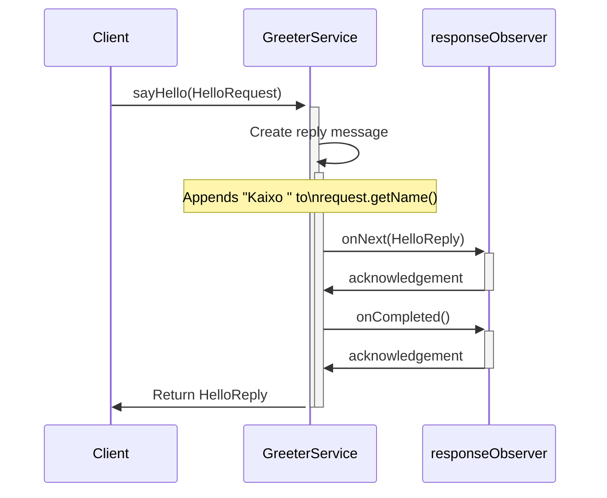
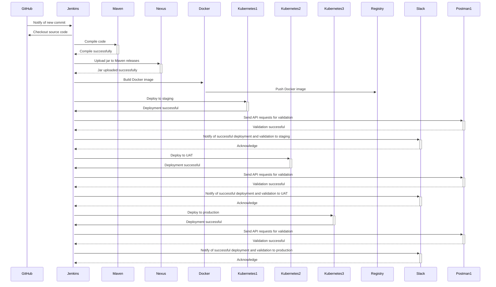

## springnine

Conjunto de pruebas automáticas que realizan la validacuión e2e de la funcionalidad del servicio cttione

## Getting started

Start write your documentation by adding more markdown (.md) files to this folder (/docs) or replace the content in this file.

## Table of Contents

The Table of Contents on the right is generated automatically based on the hierarchy
of headings. Only use one H1 (`#` in Markdown) per file.

## Pipeline

For new pages to appear in the left hand navigation you need edit the `mkdocs.yml`
file in root of your repo. The navigation can also link out to other sites.

Alternatively, if there is no `nav` section in `mkdocs.yml`, a navigation section
will be created for you. However, you will not be able to use alternate titles for
pages, or include links to other sites.

Note that MkDocs uses `mkdocs.yml`, not `mkdocs.yaml`, although both appear to work.
See also <https://www.mkdocs.org/user-guide/configuration/>.

## Support

That's it. If you need support, reach out in [#docs-like-code](https://discord.com/channels/687207715902193673/714754240933003266) on Discord.

