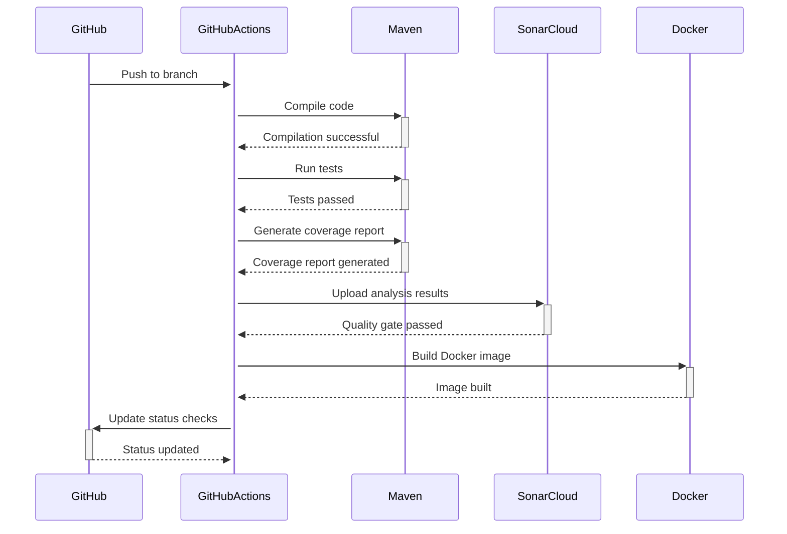

# Springnine Documentation

Welcome to the Springnine documentation. This guide provides comprehensive information about the project, its architecture, and how to use it effectively.

## Overview

Springnine is a Spring Boot application that provides a gRPC-based microservice architecture. It includes automated end-to-end testing capabilities for the cttione service and demonstrates best practices for building production-ready gRPC services with Spring Boot.

## Getting Started

This section will guide you through setting up and running Springnine on your local machine.

### Prerequisites

Before you begin, ensure you have the following installed:

- Java Development Kit (JDK) 11 or higher
- Apache Maven 3.6.x or higher
- Git for version control

### Quick Start

1. **Clone the Repository**

   ```bash
   git clone https://github.com/juananmoraorganization/springnine.git
   cd springnine
   ```

2. **Build the Project**

   ```bash
   mvn clean install -DskipTests
   ```

3. **Run the Application**

   ```bash
   mvn spring-boot:run
   ```

4. **Verify Installation**

   The gRPC server will start on port 6565. You can verify it's running by checking the console output.

## Architecture

Springnine follows a microservices architecture pattern using gRPC for inter-service communication.

### Key Components

- **Application.java**: The main Spring Boot application entry point
- **GreeterService.java**: Implementation of the gRPC Greeter service
- **greeter.proto**: Protocol Buffer definition for the service contract

### Technology Stack

- **Framework**: Spring Boot 2.2.4
- **RPC Protocol**: gRPC with Protocol Buffers
- **Build Tool**: Maven
- **Java Version**: 11
- **Testing**: JUnit 4, Spring Boot Test

## Table of Contents

The Table of Contents on the right is generated automatically based on the hierarchy
of headings. Only use one H1 (`#` in Markdown) per file.

## gRPC Service API

### Greeter Service

The Greeter service provides a simple greeting functionality via gRPC.

#### Service Definition

```protobuf
service Greeter {
    rpc SayHello (HelloRequest) returns (HelloReply) {}
}
```

#### SayHello Method

**Purpose**: Returns a greeting message for the provided name.

**Request Message**:
```protobuf
message HelloRequest {
    string name = 1;  // The name to greet
}
```

**Response Message**:
```protobuf
message HelloReply {
    string message = 1;  // The greeting message
}
```

**Behavior**: 
- Receives a `HelloRequest` containing a name
- Returns a `HelloReply` with message "Hello [name]"
- Example: Input "World" → Output "Hello World"

### Testing the gRPC Service

You can test the gRPC service using tools like:

- **grpcurl**: Command-line tool for interacting with gRPC services
- **BloomRPC**: GUI client for testing gRPC APIs
- **Postman**: Supports gRPC requests in newer versions

Example using grpcurl:

```bash
grpcurl -plaintext -d '{"name": "World"}' localhost:6565 Greeter/SayHello
```

## Development

### Building the Project

The project uses Maven as the build tool. Here are the common build commands:

**Clean and compile:**
```bash
mvn clean compile
```

**Generate sources from Protocol Buffers:**
```bash
mvn protobuf:compile protobuf:compile-custom
```

**Create JAR file:**
```bash
mvn package
```

### Running Tests

**Unit tests:**
```bash
mvn test
```

**Integration tests:**
```bash
mvn verify
```

**With code coverage:**
```bash
mvn clean test jacoco:report
```

View the coverage report at `target/site/jacoco/index.html`.

### Code Quality

The project uses several tools to maintain code quality:

- **Google Java Format**: Automatic code formatting
- **JaCoCo**: Code coverage analysis
- **SonarCloud**: Static code analysis
- **Maven Enforcer Plugin**: Dependency version management

**Format code:**
```bash
mvn fmt:format
```

**Check code formatting:**
```bash
mvn fmt:check
```

## CI/CD Pipeline

The project uses GitHub Actions for continuous integration and deployment.

### Workflow Overview


```mermaid
  sequenceDiagram
  participant GitHub
  participant GitHubActions
  participant Maven
  participant SonarCloud
  participant Docker

  GitHub->>+GitHubActions: Push to branch
  GitHubActions->>+Maven: Compile code
  Maven-->>-GitHubActions: Compilation successful
  GitHubActions->>+Maven: Run tests
  Maven-->>-GitHubActions: Tests passed
  GitHubActions->>+Maven: Generate coverage report
  Maven-->>-GitHubActions: Coverage report generated
  GitHubActions->>+SonarCloud: Upload analysis results
  SonarCloud-->>-GitHubActions: Quality gate passed
  GitHubActions->>+Docker: Build Docker image
  Docker-->>-GitHubActions: Image built
  GitHubActions->>+GitHub: Update status checks
  GitHub-->>-GitHubActions: Status updated
```

### Quality Gates

All pull requests must pass:
- Compilation without errors
- All unit and integration tests
- SonarCloud quality gate
- Code coverage thresholds

## Configuration

### Application Properties

Configuration can be customized through Spring Boot's standard configuration mechanisms:

- `application.properties` or `application.yml`
- Environment variables
- Command-line arguments

### gRPC Server Configuration

The gRPC server is configured through the `grpc-spring-boot-starter` library. Key configurations:

- **Port**: Default is 6565 (configurable via Spring properties)
- **Service Discovery**: Automatic via Spring Boot annotations
- **Interceptors**: Can be added as Spring beans

## Deployment

### Docker Deployment

A Dockerfile is provided for containerized deployment:

```bash
docker build -t springnine:latest .
docker run -p 6565:6565 springnine:latest
```

### Kubernetes Deployment

Kubernetes manifests are available in the `manifests/` directory for deploying to Kubernetes clusters.

## Troubleshooting

### Common Issues

**Issue**: Build fails with dependency conflicts

**Solution**: The project uses Maven Enforcer plugin. If you encounter dependency conflicts, you may need to skip the enforcer during development:

```bash
mvn clean install -Denforcer.skip=true
```

**Issue**: gRPC service doesn't start

**Solution**: Check that port 6565 is not already in use:

```bash
# Linux/Mac
lsof -i :6565

# Windows
netstat -ano | findstr :6565
```

**Issue**: Proto files not generating Java classes

**Solution**: Run the protobuf compilation explicitly:

```bash
mvn clean protobuf:compile protobuf:compile-custom
```

## Additional Resources

### Documentation

- For more details on MkDocs configuration, see <https://www.mkdocs.org/user-guide/configuration/>
- Spring Boot gRPC Starter: <https://github.com/LogNet/grpc-spring-boot-starter>
- Protocol Buffers: <https://developers.google.com/protocol-buffers>
- gRPC Documentation: <https://grpc.io/docs/>

### Support

If you need support or have questions:

1. Check the [GitHub Issues](https://github.com/juananmoraorganization/springnine/issues) for existing questions
2. Create a new issue with detailed information about your problem
3. Refer to the project's contributing guidelines

## Contributing

We welcome contributions! To contribute:

1. Fork the repository
2. Create a feature branch
3. Make your changes
4. Write or update tests
5. Ensure all tests pass
6. Submit a pull request

See [CONTRIBUTING.md](../CONTRIBUTING.md) for detailed contribution guidelines.

